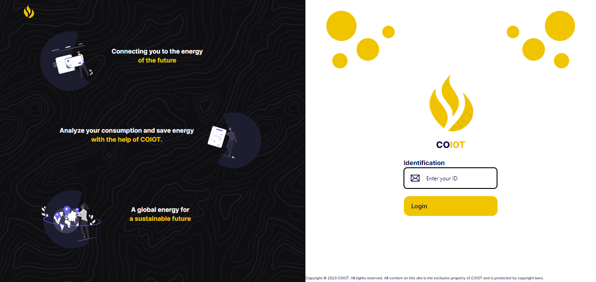
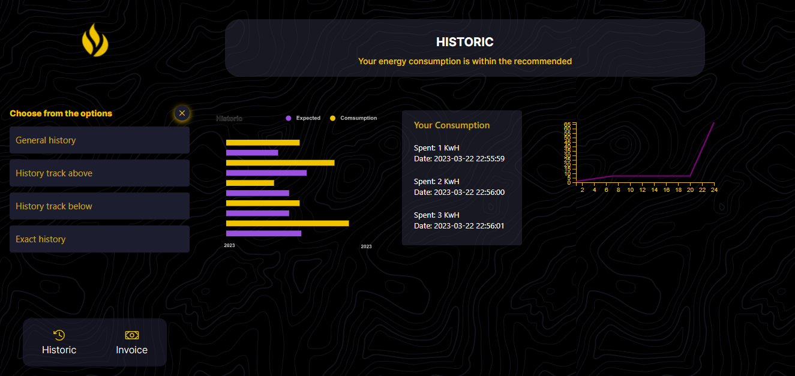
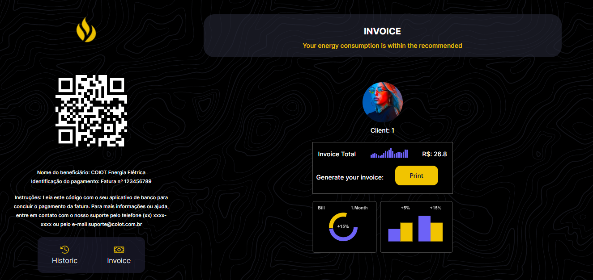

<div id="image03" style="display: inline_block" align="center">
		
		</div>

</div>


<h1 align="center"> Sumário 📖 </h1>
<div id="sumario" style="display: inline_block" align="center">
	<a href="#intro"> Introdução  </a> |
	<a href="#conceitos"> Conceitos & Metodologia </a> |
	<a href="#docker"> Docker </a> |
	<a href="#conclusao"> Conclusão </a>
</div>
<br>

<div id="intro">

# Introdução 🎉

A eficiência no fornecimento de energia elétrica é essencial para uma cidade inteligente e sustentável. Visando oferecer um serviço de qualidade para a população, a prefeitura de uma cidade resolveu adotar uma infraestrutura de IoT para monitorar o consumo de energia elétrica em tempo real e promover o uso consciente dos recursos.

Para atingir esse objetivo, a prefeitura e a concessionária de abastecimento lançaram um edital que busca empreendedores de tecnologia especializados em IoT para apresentar soluções que permitam a coleta e análise dos dados de consumo de energia elétrica em larga escala.

Nesse contexto, nossa startup foi convidada a apresentar um protótipo que utiliza tecnologias de IoT para coletar, processar e apresentar os dados de consumo de energia elétrica de forma simples e acessível. Nosso sistema permitirá que cada cliente tenha um controle mais preciso sobre seu consumo de energia elétrica, podendo monitorá-lo em tempo real e identificar possíveis gargalos que gerem desperdícios e gastos excessivos.

Neste relatório, apresentaremos um protótipo desenvolvido por uma startup fictícia que visa solucionar o problema proposto pela prefeitura. O protótipo consiste em um sistema de coleta de dados automatizado, que permite a geração de informações precisas sobre o consumo de energia em residências, o cálculo da fatura a ser paga e o envio de alertas aos usuários em caso de consumo excessivo ou variação na conta. Além disso, a solução envolve um servidor soquete que irá receber dados dos medidores inteligentes instalados nas residências dos usuários, e será possível visualizar esses dados de forma online através de uma interface web que consome uma API REST.

Ao longo deste relatório, detalharemos a arquitetura do sistema, as tecnologias utilizadas, os resultados obtidos e as possíveis melhorias para o futuro. Esperamos que este relatório seja útil para outras empresas e prefeituras que desejam incorporar a loT em seus serviços e tornar suas cidades mais inteligentes.

Vamos juntos nessa jornada em busca de uma cidade mais inteligente e sustentável! 💡🌍
</div>

<div id="conceitos">

# Conceitos & Metodologia 📚

O código desenvolvido é dividido em três grandes partes: a primeira parte é o medidor, que funciona como o cliente e é responsável por enviar os dados de consumo de energia para o servidor. A segunda parte é o servidor, que armazena todos os dados enviados pelos medidores via soquete. E a terceira parte é o usuário online, onde foi criada uma interface web usando React para visualizar os dados de consumo de energia em tempo real.

Os conceitos que abrangem o problema principal do projeto são: o uso de soquetes para comunicação entre dispositivos diferentes, API REST, que permite levar esses dados para o cliente através do protocolo HTTP, o uso de threads e outras formas para acompanhar múltiplas conexões, e o Docker para containerização do projeto, garantindo que o ambiente de desenvolvimento e de produção sejam iguais, facilitando a implantação do sistema.

Esses conceitos serão mais discutidos durante as 3 partes que compõe a aplicação, assim como sua metodologia.

<lu>
    <li><a href="#client">Client</a></li>
    <li><a href="#server">Server</a></li>
    <li><a href="#user">User</a></li>
</lu>
</div>

<br>

<div id="client">  
  
# Measurer (Cliente/Medidor) 📱

## Funcionalidades 🚀

O cliente tem as seguintes funcionalidades:

- Envia dados de consumo de energia elétrica para um servidor
- Permite ao usuário configurar a taxa de consumo de energia elétrica

## Bibliotecas utilizadas 📚

Para implementar o cliente, foram utilizadas as seguintes bibliotecas Python:

- `socket`: para criar e configurar o socket de rede
- `json`: para serializar os dados em formato JSON
- `datetime`: para gerar a data e hora atuais
- `time`: para controlar o tempo de envio de dados
- `threading`: para executar o envio de dados e a configuração de taxa de consumo em threads separadas

## Como executar 🛠️

Para executar o cliente, é necessário executar o arquivo client.py.

```console
python measurer.py
```

## Como usar 📝

1. Clone este repositório em sua máquina local.
2. Certifique-se de que os requisitos estejam instalados.
3. Execute o servidor primeiro.
4. Em seguida, execute o arquivo measurer.py.
5. Siga as instruções do menu para alterar a taxa de consumo ou sair do programa.

O cliente está configurado para enviar dados para o servidor com endereço IP "172.16.103.2" e porta 4005. Para configurar a taxa de consumo de energia elétrica, siga as opções exibidas no menu. Para sair do programa, escolha a opção "4".

## Como funciona 📝

O cliente é responsável por enviar dados do consumo de energia elétrica para o servidor através de uma conexão socket TCP/IP. Ele é desenvolvido em Python e utiliza a biblioteca socket para realizar a comunicação com o servidor. O cliente é iniciado a partir da execução do arquivo measurer.py.

O código do cliente é dividido em duas principais funções:

### Função get_id()
Essa função é responsável por solicitar ao servidor um ID para o medidor de consumo de energia elétrica. Ela envia uma mensagem JSON contendo o valor 0 para o servidor e aguarda a resposta com o ID, que é armazenado na variável id.

### Função send_data()
Essa função é responsável por enviar para o servidor os dados de consumo de energia elétrica em tempo real. Ela envia uma mensagem JSON contendo o ID do medidor, o valor do consumo, a data e hora do consumo e o tipo de mensagem. A variável rate é utilizada para simular o consumo em tempo real, e a variável spent é utilizada para armazenar o total consumido pelo medidor.

Além dessas funções, o código do cliente também possui uma função menu() que permite ao usuário alterar a taxa de consumo do medidor. Essa função é executada em uma thread separada, e permite que o usuário aumente, diminua ou defina uma nova taxa de consumo. A thread principal do cliente é responsável por enviar os dados de consumo em tempo real.

Ao final da execução, o cliente é encerrado e a conexão com o servidor é fechada.

</div>

<div id="server">

# Server (API REST) 🖥️🌐

## Funcionalidades 🚀
O servidor tem as seguintes funcionalidades:

- Recebe requisições HTTP GET e POST
- Interpreta as requisições e envia a resposta adequada para cada uma delas
- Armazena os dados das requisições POST para uso posterior

## Bibliotecas utilizadas 📚

Para implementar o servidor, foram utilizadas as seguintes bibliotecas Python:

- `socket`: para criar e configurar o socket de rede
- `selectors`: para gerenciar eventos de I/O de forma eficiente
- `types`: para definir os tipos dos objetos utilizados pelo programa
- `json`: para serializar os dados em formato JSON

## Como executar 🛠️
Para executar o servidor, é necessário executar o arquivo initialize.py e estar no mesmo diretório do arquivo.

```console
python initialize.py
```
## Como funciona 📝

O código apresentado é um servidor web simples que pode lidar com as solicitações GET e POST enviadas por um cliente. Ele utiliza a biblioteca selectors para suportar operações de I/O multiplexadas, permitindo que o servidor possa lidar com várias conexões de forma eficiente.

Inicialmente, o servidor cria um objeto DefaultSelector() da biblioteca selectors que será responsável por gerenciar as operações de I/O das conexões. Em seguida, ele define um endereço IP e porta para a conexão do socket e cria um socket de escuta com o método socket(). O socket de escuta aguarda a conexão de novos clientes.

O método register() é utilizado para registrar um socket com o seletor de E/S, especificando o evento a ser monitorado (EVENT_READ para leitura ou EVENT_WRITE para escrita), bem como os dados adicionais que serão associados ao socket.

O método accept_wrapper() é chamado sempre que uma nova conexão é aceita pelo servidor. Ele extrai a conexão e o endereço do cliente e registra o socket com o seletor de E/S, especificando os eventos a serem monitorados.

O método service_connection() é responsável por processar as solicitações recebidas de cada conexão registrada. Ele verifica se há dados a serem lidos e, se sim, os armazena em um buffer. Em seguida, ele chama a função type_mensage() para analisar a solicitação recebida e determinar se ela é uma solicitação GET, POST ou outro tipo de solicitação. Dependendo do tipo de solicitação, o método service_connection() pode chamar as funções get() ou post() para processar os dados e gerar uma resposta. Se houver dados a serem escritos, o método service_connection() envia a resposta para o cliente. Se a solicitação não puder ser processada, o método type_mensage() retorna um erro.

O servidor continua a executar em um loop infinito, aguardando novas conexões e processando as solicitações recebidas. O loop é interrompido somente se o programa for interrompido por um sinal de teclado (KeyboardInterrupt). Quando o loop é interrompido, o servidor é encerrado e o seletor de E/S é fechado com o método close().

</div>

<div id ="user">

# User (Frontend) 👤💻

Este é um projeto para construir um frontend para um sistema de medição de consumo de energia elétrica. O frontend foi construído utilizando React, Tailwind CSS e TypeScript, com a configuração do ambiente utilizando Vite. Para criar a interface, foram utilizadas as bibliotecas de UI Radix UI e Material UI. O consumo de dados é feito através do Axios, que consome a API previamente desenvolvida.

## Funcionalidades 🚀
O frontend tem as seguintes funcionalidades:

- Tela de login na rota "/signin"
- Após inserir o ID válido, o cliente é redirecionado para a página de histórico, que mostra o histórico de consumo atual e gráficos relacionados a ele
- Na tela de histórico, é possível ir para a tela de fatura (invoice), que contém o valor atual da fatura e algumas informações, juntamente com o QRCode da fatura.

## Bibliotecas utilizadas 📚
Para implementar o frontend, foram utilizadas as seguintes bibliotecas:

- React: para a criação de componentes reutilizáveis
- Tailwind CSS: para a estilização da interface
- TypeScript: para o desenvolvimento de código mais seguro e com maior integridade
- Vite: para a configuração do ambiente de desenvolvimento
- Axios: para o consumo da API previamente desenvolvida
- Radix UI: para a criação de componentes de interface personalizados
- Material UI: para a utilização de ícones e componentes predefinidos

## Como executar 🛠️
Para executar o frontend, primeiro deve se  atentar a ter já seu server e alguns clientes rodando para uma melhor visualização da interface, além de evitar erros. Dito isso, é necessário  executar o seguinte comando:

```console
npm install
npm run dev
```

## Como Funciona 📝

Como não foi solicitado uma interface web para o cliente, não entraremos em muitos detalhes de como foi feito. No entanto, é possível utilizar as telas de login, histórico e fatura do sistema através das rotas "/signin", "/history" e "/invoice", respectivamente. Para acessar a tela de fatura, é necessário ter inserido um ID válido na tela de login.

<br>

<div id="image01" style="display: inline_block" align="center">
		
		<p>
			Tela de Login
			</p>
		</div>

</div>

<div id="image02" style="display: inline_block" align="center">
		
		<p>
			Tela de Histórico
			</p>
		</div>

</div>

<div id="image03" style="display: inline_block" align="center">
		
		<p>
			Tela de Fatura
			</p>
		</div>

</div>

<div id="docker">

# Docker 🐳


</div>

<div id ="conclusao">

# Conclusão 🏁

Com base no projeto desenvolvido, foi possível implementar um sistema de medição de energia elétrica em Python. O projeto foi dividido em duas partes principais: o backend e o frontend. No backend, foi implementado um servidor que recebe os dados de consumo de energia elétrica enviados pelos clientes. Foi utilizado o protocolo TCP/IP para a comunicação entre os clientes e o servidor, e a biblioteca Socket do Python foi utilizada para implementar o servidor.

No frontend, foi desenvolvido um cliente que envia os dados de consumo de energia elétrica para o servidor. O cliente foi implementado utilizando a biblioteca Socket do Python para criar e configurar o socket de rede, a biblioteca JSON para serializar os dados em formato JSON, a biblioteca Datetime para gerar a data e hora atuais, e a biblioteca Threading para executar o envio de dados e a configuração de taxa de consumo em threads separadas. O cliente permite ao usuário configurar a taxa de consumo de energia elétrica e enviar os dados para o servidor.

Além disso, foi desenvolvido um frontend em React, Tailwind CSS e Typescript, utilizando as bibliotecas Radix UI e Material UI para os componentes de interface do usuário. O frontend possui três principais páginas: a página de login, a página de histórico e a página de fatura. Na página de login, o usuário insere seu ID de cadastro válido e é redirecionado para a página de histórico, que mostra o histórico de consumo atual e gráficos relacionados a ele. Nessa página, o usuário pode ir para a página de fatura, que mostra o valor atual da fatura e algumas informações juntamente com o QRCode da fatura.

O projeto foi um sucesso, e todas as funcionalidades propostas foram implementadas com sucesso. A entrega do projeto foi feita dentro do prazo estipulado e com alta qualidade. O resultado final foi um sistema de medição de energia elétrica robusto e funcional, que atende às necessidades dos usuários de forma eficiente e fácil de usar.

</div>